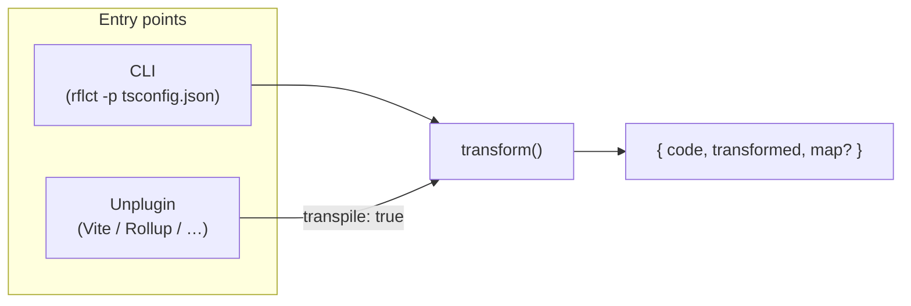
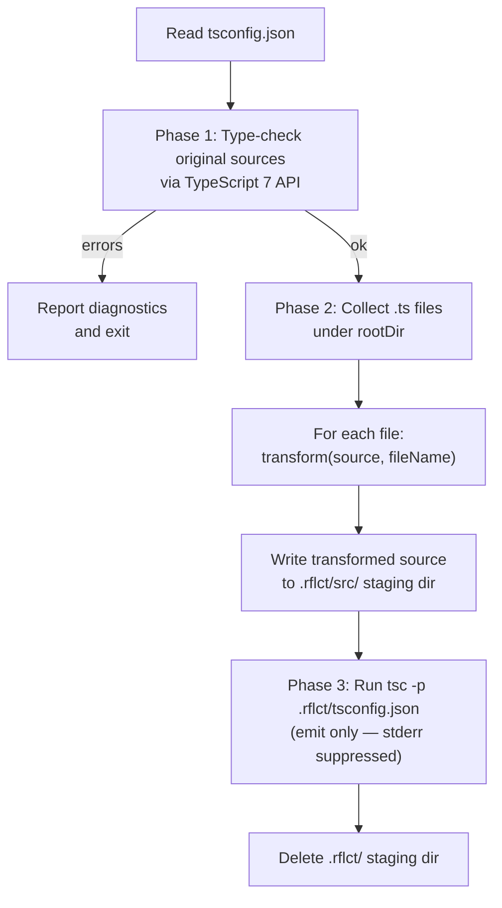
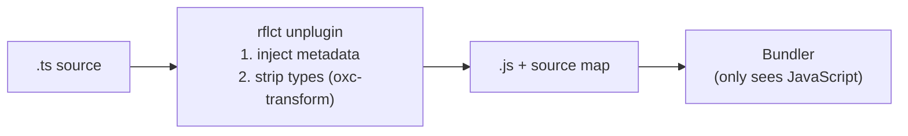
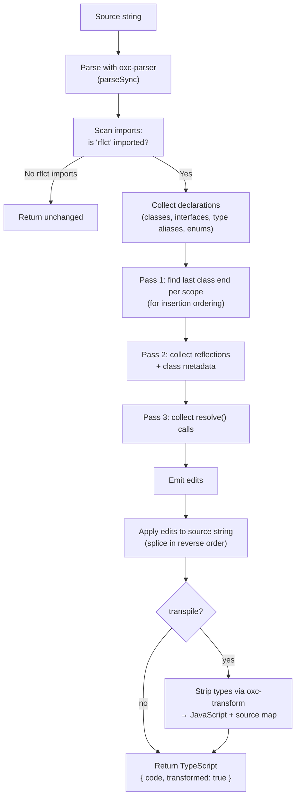
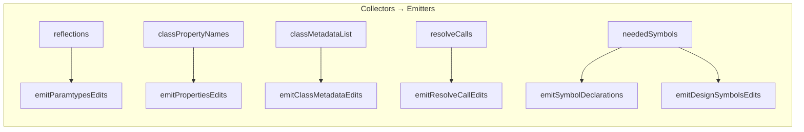

# Internals

How rflct transforms TypeScript source files into JavaScript with injected runtime metadata.

## Entry points

rflct can be invoked two ways:

1. **CLI** (`rflct -p tsconfig.json`) — reads files from disk, transforms them, writes to a staging directory, then runs `tsc`.
2. **Unplugin** (Vite / Rollup / webpack / esbuild) — hooks into the bundler's `transform` phase; each file is transformed in-memory before the bundler sees it.

Both ultimately call a single pure function: `transform(source, fileName, options)`.



## CLI pipeline



Source files on disk are never modified. Type checking runs against the **original sources** (where `Reflect<T>` imports are valid) via the TS7 `typescript/unstable/sync` API before any transformation happens. Transformation and staging happen only after type checking passes. The `tsc` emit step operates on the staged files; its stderr is suppressed since type errors from stripped `Reflect` imports are expected and harmless.

> **Why staging?** TypeScript 7 (tsgo) does not expose an `emit()` method in its Node.js API — only `Program.getSemanticDiagnostics()` and `Emitter.printNode()`. The `tsc` CLI is the only way to produce compiled JS output from tsgo, which requires files on disk. A future improvement could use `oxc-transform` (already a dependency for the unplugin's `transpile` mode) to emit JS in-memory and eliminate the staging step entirely.

## Unplugin pipeline

The unplugin registers with `enforce: 'pre'` so it runs before other plugins. By default it enables `transpile: true`, so the output is **JavaScript** — downstream plugins (esbuild, SWC, etc.) never need to parse TypeScript:



For every `.ts` / `.tsx` / `.mts` / `.cts` file that isn't in `node_modules`:

1. Call `transform(source, id, { transpile: true })`.
2. If `transformed` is `true`, return the JS `code` and source map to the bundler.
3. If `false`, return `null` (no change — the bundler's own TS handling takes over).

This makes rflct independent of whatever TypeScript transpiler the consumer has (or doesn't have). Consumers can disable the transpilation with `transpile: false` if they prefer to let their own TS plugin handle type stripping.

## The `transform()` function

This is the core of rflct. It takes a single source string and returns a new source string with metadata calls injected. All work is done on the AST — no TypeScript type-checker is needed.



### Step 1 — Parse

The source is parsed with [oxc-parser](https://github.com/nicolo-ribaudo/oxc-parser) (`parseSync`). This produces a full TypeScript AST including type annotations, but runs at native speed (Rust). If parsing fails, the file is returned unchanged.

### Step 2 — Scan imports

The transformer scans top-level `ImportDeclaration` nodes looking for imports from `'rflct'`. It collects the local names of imported symbols (`Reflect`, `Reflectable`, `resolve`, plus any configured aliases). If none are found, the file is returned unchanged — this makes the transform a no-op for the vast majority of files.

### Step 3 — Collect declarations

Every top-level and nested declaration is catalogued into a `Map<string, DeclInfo>`:

| Declaration kind | `DeclInfo.kind` | Example |
|---|---|---|
| `class` | `'class'` | `class Foo {}` |
| `interface` | `'interface'` | `interface IFoo {}` |
| `type alias` | `'type'` | `type Config = { ... }` |
| `enum` | `'class'` | `enum Status { ... }` |

This map is used later to decide how to serialize type references — classes exist at runtime, interfaces and type aliases don't.

### Step 4 — Three AST passes

The transformer walks the AST three times using `walkAllNodesWithScope`, which tracks function-scope boundaries and merges local declarations into the scope's declaration map.

#### Pass 1: Compute insertion points

Finds the end position of the last class declaration within each scope. All metadata calls for classes in the same scope are inserted after this point, keeping emitted code grouped together.

#### Pass 2: Collect reflections and class metadata

For each class:

- **`collectClassReflections`** — scans constructor params, method params, and property definitions for `Reflect<T>` markers (or configured aliases). For classes implementing `Reflectable`, constructor params are auto-reflected without explicit markers. Each parameter's type annotation is serialized to a runtime expression.

- **`collectClassMetadata`** — checks if the class `implements Reflectable<T>` (or an alias). If so, records the metadata expression for `design:class` emission.

#### Pass 3: Collect resolve() calls

Finds `resolve<T>()` call expressions and records a replacement — the call is replaced inline with the runtime identity of `T` (the class reference for classes, a `Symbol.for(...)` constant for interfaces/types).

### Step 5 — Emit edits

Each collector produces data structures. The emit phase converts them into `Edit` objects (`{ start, end, replacement }`):



| Emitter | What it produces |
|---|---|
| `emitParamtypesEdits` | `Reflect.defineMetadata("design:paramtypes", [...], Class, key)` |
| `emitPropertiesEdits` | `Reflect.defineMetadata("design:properties", [...], Class)` |
| `emitClassMetadataEdits` | `Reflect.defineMetadata("design:class", {...}, Class)` |
| `emitResolveCallEdits` | Replaces `resolve<T>()` with `T` or `__RFLCT_T` inline |
| `emitSymbolDeclarations` | `const __RFLCT_IFoo = Symbol.for("pkg@1\|file.ts\|IFoo");` at the top of the file |
| `emitDesignSymbolsEdits` | `Reflect.defineMetadata("design:symbols", {...}, Reflect)` at the end of the file |

Additionally, the rflct package import declaration itself is removed (it's type-only at runtime).

### Step 6 — Apply edits

All edits are sorted in reverse source order and spliced into the source string. Reverse order ensures earlier edits don't shift the positions of later ones.

## Type serialization

`serializeTypeNode` converts a TypeScript type annotation AST node into a runtime expression. It follows TypeScript's `emitDecoratorMetadata` rules for most types, with one exception: **literal types are preserved** as their actual values (instead of `Object`), enabling string/number/boolean service identifiers in DI containers.

| TypeScript type | Runtime expression |
|---|---|
| `string` | `String` |
| `number` | `Number` |
| `boolean` | `Boolean` |
| `bigint` | `BigInt` |
| `symbol` | `Symbol` |
| `void`, `null`, `undefined` | `void 0` |
| `string[]`, `[string, number]` | `Array` |
| `readonly string[]` | `Array` |
| `() => void` | `Function` |
| `MyClass` (class reference) | `MyClass` |
| `IFoo` (interface/type alias) | `__RFLCT_IFoo` (Symbol constant) |
| `Promise<T>`, `Map<K,V>` | `Promise`, `Map` (reference name) |
| `"bar"` (string literal) | `"bar"` |
| `42` (numeric literal) | `42` |
| `true` (boolean literal) | `true` |
| unions, intersections, `any`, `unknown`, `never`, `object`, template literals, conditionals | `Object` |

## Symbol qualification

Interfaces and type aliases don't exist at runtime. rflct replaces them with deterministic `Symbol.for(...)` constants using qualified names:

```
Symbol.for("@my-app@1|src/services/Logger.ts|ILogger")
```

The format is `packageName@majorVersion|relativePath|typeName`. This is globally unique and stable across builds. The `design:symbols` registry at the end of each file maps these qualified names to their runtime values, enabling DI containers to look up types by symbol.

## Module structure

```
src/
├── cli.ts                  CLI entry point
├── unplugin.ts             Bundler plugin (Vite/Rollup/webpack/esbuild)
├── index.ts                Re-exports transform + package utils
└── core/
    ├── transform.ts        Orchestrator — the transform() function
    ├── ast.ts              AST walking, scope tracking, edit application
    ├── serialize.ts        Type node → runtime expression (emitDecoratorMetadata parity)
    ├── design-paramtypes.ts  Collect + emit design:paramtypes / design:propertytype
    ├── design-class.ts     Collect + emit design:class (Reflectable)
    ├── design-symbols.ts   Emit symbol declarations + design:symbols registry
    ├── resolve-calls.ts    Collect + emit resolve<T>() replacements
    ├── package.ts          Nearest package.json lookup + qualified name generation
    └── types.ts            Shared types and constants

runtime/
├── index.ts                Runtime resolve() stub (throws if transform didn't run)
└── index.js                Pre-compiled JS of the above

types/
└── index.ts                Type definitions (Reflect<T>, Reflectable<T>, resolve<T>)
```
